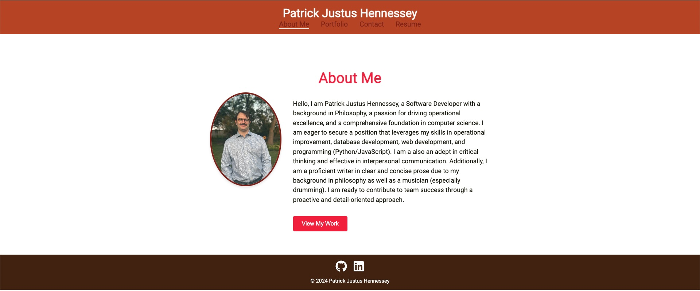

# Portfolio-using-React

## Description

A personal portfolio website for my software development projects created using React and other modern technologies. 

## Table of Contents
        
- [Installation](#installation)
- [Usage](#usage)
- [Credits](#credits)
- [License](#license)

## Installation

This application uses React and vite to create responsive portfolio. 

## Usage 

This portfolio is deployed on Github Pages. Use the following link:

https://rickhennessey87.github.io/about

## Credits
        
GitHub: https://github.com/RickHennessey87
Email: pjhennessey89@gmail.com

## License
    
This project is covered by the MIT License license.

[MIT License](https://opensource.org/licenses/MIT)